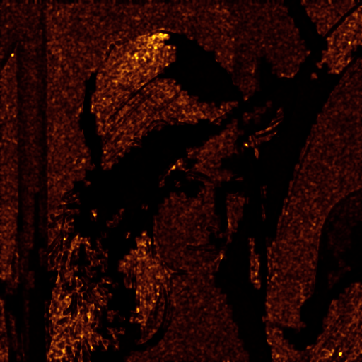

Adept - the adaptive JPG Compressor
====================

## Quick Start

* Please install [a MSS saliency algorithm binary](http://github.com/technopagan/mss-saliency), [ImageMagick](http://www.imagemagick.org/), [MozJPEG](https://github.com/mozilla/mozjpeg) and [JPEGrescan](https://github.com/kud/jpegrescan)
* Make MozJPEG available as "mozjpeg" in your $PATH, e.g. via symlink
* Fetch a copy of [adept](https://raw.github.com/technopagan/adept-jpg-compressor/master/adept.sh) and place it somewhere you deem a good place for 3rd party shellscripts, e.g. "/usr/local/bin". Make sure the location is in the $PATH of the user(s) who will run adept and ensure that the script is executable (chmod -x).
* Symlink it as "adept" for your own convenience
* Now you can run "adept /path/to/image.jpg" to compress JPEGs far more effectively!

## Introduction

When compressing JPEG images, the same compression level is used on the entire image. However, most JPEG images contain homogeneous and heterogeneous areas, which are varyingly well-suited for compression. Compressing heterogeneous areas in JPEGs to reduce filesize causes [compression artefacts](https://en.wikipedia.org/wiki/Compression_artifact) due to the lossy nature of JPEG compression.

This script adaptively alters the compression level for areas within JPEGs (per-block) to achieve optimized file size while maintaining a decent visual quality. This script achieves a significantly reduced file size compared to standard tools such as cjpeg while maintaining good visual quality, as can be measured via SSIM. This is good news for the [Web Performance](https://twitter.com/search?q=%23WebPerf&src=typd) and thus Web Developer community to achieve a great user experience on websites.

## Example

Best quality/size:

```
$ convert -verbose -quality 100 images/lena.png images/lena.q100.jpg
images/lena.png PNG 512x512 512x512+0+0 8-bit DirectClass 475KB 0.010u 0:00.010
images/lena.png=>images/lena.q100.jpg PNG 512x512 512x512+0+0 8-bit DirectClass 401KB 0.030u 0:00.039

$ ./adept-jpeg.sh images/lena.q100.jpg
./adept-jpeg.sh options: inherit, 69, autodetect, _adept_compress_imagemagick
404266 images/lena.q100.jpg
size=8 512 512
tilecount=64x64
salient=1.04084
salient=74.321
salient=48.2852
salient=36.5063
threshold=43
slice to ram... ok.
estimate content complexity and compress... 4096 tile ok.
final image... ok.
200860 images/lena.q100_adept_compress_imagemagick.jpg (50%)

$ dssim -o images/lena.q100_adept_compress_imagemagick.c.png images/lena.png images/lena.q100_adept_compress_imagemagick.jpg
0.00236562  lena.q100_adept_compress_imagemagick.jpg
```
   

PNG -> JPEG Q=100 -> ADEPT JPEG -> Compare (DSSIM)

## Contributors

In alphabetical order:

 * [Andy Davies](http://twitter.com/andydavies)
 * [Gregor Fabritius](http://twitter.com/grefab)
 * [Neil Jedrzejewski](http://www.wunderboy.org/about.php)
 * [Alessandro Lenzen](http://twitter.com/adelnorsz)
 * [Claus Meteling](http://www.xing.com/profile/Claus_Meteling)
 * [André Roaldseth](http://twitter.com/androa)
 * [Christian Schäfer](http://twitter.com/derSchepp)
 * [Yoav Weiss](http://twitter.com/yoavweiss)

## Licence

This software is published under the BSD licence 3.0

Copyright (c) 2015, Tobias Baldauf
All rights reserved.

Mail: [kontakt@tobias-baldauf.de](mailto:kontakt@tobias-baldauf.de)
Web: [who.tobias.is](http://who.tobias.is/)
Twitter: [@tbaldauf](http://twitter.com/tbaldauf)

Redistribution and use in source and binary forms, with or without modification, are permitted provided that the following conditions are met:

 * Redistributions of source code must retain the above copyright notice, this list of conditions and the following disclaimer.
 * Redistributions in binary form must reproduce the above copyright notice, this list of conditions and the following disclaimer in the documentation and/or other materials provided with the distribution.
 * Neither the name of the author nor the names of contributors may be used to endorse or promote products derived from this software without specific prior written permission.

THIS SOFTWARE IS PROVIDED BY THE COPYRIGHT HOLDERS AND CONTRIBUTORS "AS IS" AND ANY EXPRESS OR IMPLIED WARRANTIES, INCLUDING, BUT NOT LIMITED TO, THE IMPLIED WARRANTIES OF MERCHANTABILITY AND FITNESS FOR A PARTICULAR PURPOSE ARE DISCLAIMED. IN NO EVENT SHALL THE COPYRIGHT HOLDER OR CONTRIBUTORS BE LIABLE FOR ANY DIRECT, INDIRECT, INCIDENTAL, SPECIAL, EXEMPLARY, OR CONSEQUENTIAL DAMAGES (INCLUDING, BUT NOT LIMITED TO, PROCUREMENT OF SUBSTITUTE GOODS OR SERVICES; LOSS OF USE, DATA, OR PROFITS; OR BUSINESS INTERRUPTION) HOWEVER CAUSED AND ON ANY THEORY OF LIABILITY, WHETHER IN CONTRACT, STRICT LIABILITY, OR TORT (INCLUDING NEGLIGENCE OR OTHERWISE) ARISING IN ANY WAY OUT OF THE USE OF THIS SOFTWARE, EVEN IF ADVISED OF THE POSSIBILITY OF SUCH DAMAGE.
