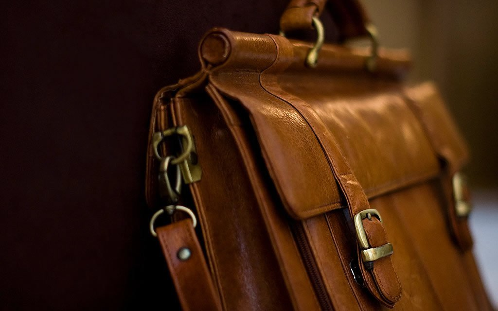

Adept - the adaptive JPG Compressor
====================

## Quick Start

* Remember: Adept is a **Linux commandline tool**
* Make sure you have [ImageMagick](http://www.imagemagick.org/), [Jpegoptim](https://github.com/tjko/jpegoptim) and [JPEGrescan](https://github.com/kud/jpegrescan) installed & useable. All but JPEGrescan are available in all major Linux distributions.
* Fetch a copy of [adept.sh](https://raw.github.com/technopagan/adept-jpg-compressor/master/adept.sh) and place it somewhere you deem a good place for 3rd party shellscripts, e.g. "/usr/local/bin". Make sure the location is in the PATH of the user(s) who will run adept.sh and ensure that the script is executable (chmod -x).
* Congratulations! You can now run "bash adept.sh /path/to/image.jpg" to compress JPEGs 3-5% more succcessfully. 

## Introduction

When compressing JPEG images, the same compression level is used on the entire image. However, most JPEG images contain homogeneous and heterogeneous areas, which are varyingly well-suited for compression. Compressing heterogeneous areas in JPEGs to reduce filesize causes [compression artefacts](https://en.wikipedia.org/wiki/Compression_artifact) due to the lossy nature of JPEG compression.

This script adaptively alters the compression level for areas within JPEGs to achieve optimal filesize while maintaining decent visual quality. Currently, this script achieves an average 3-5% of reduced filesize compared to standard CLI tools such as jpegoptim while still maintaining good visual quality. This is primarily interesting for the [#WebPerf](https://twitter.com/search?q=%23WebPerf&src=typd) community.

Note that adaptive JPEG compression is already implemented in tools such as Adobe Photoshop and Fireworks. This script brings adaptive JPEG compression to the shell using common console tools already installed on many machines dealing with automated image optimization. The script is save to use as ELA, the [Error Level Analysis Algorithm](http://fotoforensics.com/tutorial-ela.php), does [not flag the images as tainted](http://fotoforensics.com/analysis.php?id=9955933a9ea6774a0e58303db1ac104af8dafd41.107232).

## Image Demos

### On The Beach

**GIMP, Save For Web Plugin, Quality 85 - 112,7 kB**

GIMP's Save for Web, q85, optimized, Basline & stripped EXIF is the base configuration for all of our test images.

**JPEGOptim --max=85 -t -v --strip-all + lossless JPEGRescan - 110,4 kB**

Using popular commandline tools for JPG compression, we can achieve a 2.04% smaller filesize with no perceivable loss in quality.

**Adept - 107,2 kB**

With Adept, the filesize is reduced by 4.88%. Slight artefacts can be perceived when zooming in closely on the horizon's blue gradiant because Adept identified the sky as an area of low complexity and thus compressed it more heavily. No artifacts are present at any of the key areas of the image, however (parasol, canvas chair, horizon border, sea-to-sand border etc). 

**Adobe Fireworks + @pornelski's ImageOptim - 106,9 kB**

The commercial Adobe suite, combined with postprocessing by [ImageOptim](http://imageoptim.com/) by [@pornelski](https://twitter.com/pornelski), both set to identical quality settings as the other tools, produces the best result: 5.01% filesize reduction while the horizon's blue gradiant features fewer compression artefacts. Impressive! Sadly, this is not automatable at scale.

**JPEGMini - 98,4 kB**

The big noise of 2011. JPEGMini claimed they reinvented JPEG compression while not breaking the ISO standard. And Yes, the image created by JPEGMini features a whoppin filesize reduction of 12.68%. Sadly, it is also the image with the most visible compression artefacts, also around the key areas of the image. There also is a severe loss of detail on the waves as well as the sand.

### The Satchel

**GIMP, Save For Web Plugin, Quality 85 - 76,1 kB**

Again, GIMP Save for Web, q85, optimized, Basline & stripped EXIF. This image was chosen specifically for [@mikebrittain](https://twitter.com/mikebrittain) of [Etsy's Engineering Team](https://twitter.com/codeascraft) because they are [batch-processing tons of leather satchel images](http://codeascraft.etsy.com/2010/07/09/batch-processing-millions-of-images/) daily. ;)

**JPEGOptim --max=85 -t -v --strip-all + lossless JPEGRescan - 75,5 kB**

Using popular commandline tools, we achieve only a 0.78% smaller filesize without perceivable loss in quality.

**Adept - 68,4 kB**

Adept reduces the image filesize by 10.12%! This is possible thanks to the large dark areas on the lefthand side of the image. The only visible compression artefacts caused by Adept are located in the bright patch of out-of-focus wall far behind the satchel.

**Adobe Fireworks + @pornelski's ImageOptim - 69,1 kB**

Adobe Fireworks + ImageOptim save 9.19% of filesize. While this makes the resulting image a little larger than the version created by Adept, one has to consider that the Adobe version handles the noise in the off-focus background more gracefully, therefore again taking the crown of balance between filesize and visual quality. Once more, it's sadly not automatable and wouldn't scale well.

**JPEGMini - 56,7 kB**

JPEGMini achieves 25.48% smaller filessize on the leather satchel image. Again, this comes at a cost of reduced visual quality: the leather texture in the foreground, esp. on high contrast areas such as the belt or the handlebar, becomes blurry and loses contrast.

## Known Issues

 * Currently, Adept handles images of large dimensions poorly. While it compresses an image of e.g. 500x400 pixels very well (gain > 10%) and maintains good visual quality, it actually creates an even larger output image than the original when dealing with sizes of >1.5 megapixels. So while you can already deploy Adept for smaller website images today, do not run it on high resolution images yet. This is an aspect of Adept that will be addressed ASAP.
 * Images with high noise ratios, such as the famous [Lenna](https://en.wikipedia.org/wiki/Lenna), the de facto standard test image for image processing algorithms, will not compress well with Adept without configurating the threshold value. Otherwise, too few areas of the image will become compressed for the filesize to be reduced significantly. An automagic pre-assessment of incoming images to dynamically change the threshold value is already in [Adept's Issue Tracker](https://github.com/technopagan/adept-jpg-compressor/issues).
 * Runtime for Adept greatly changes with input image size, tile-size and available hardware. While small images of e.g. 500x400 take only 1s to process successfully, running Adept on high-megapixel images will take >20s - combined with the lack of success on such large images (see above).

## Contributors

In alphabetical order:

 * [Andy Davies](http://twitter.com/andydavies)
 * [Gregor Fabritius](http://twitter.com/grefab)
 * [Claus Meteling](http://www.xing.com/profile/Claus_Meteling)
 * [Christian Schäfer](http://twitter.com/derSchepp)
 * [Yoav Weiss](http://twitter.com/yoavweiss)

## Licence

This software is published under the BSD licence 3.0
 
Copyright (c) 2013, Tobias Baldauf
All rights reserved.

Mail: [kontakt@tobias-baldauf.de](mailto:kontakt@tobias-baldauf.de)
Web: [who.tobias.is](http://who.tobias.is/)
Twitter: [@tbaldauf](http://twitter.com/tbaldauf)

Redistribution and use in source and binary forms, with or without modification, are permitted provided that the following conditions are met:

 * Redistributions of source code must retain the above copyright notice, this list of conditions and the following disclaimer.
 * Redistributions in binary form must reproduce the above copyright notice, this list of conditions and the following disclaimer in the documentation and/or other materials provided with the distribution.
 * Neither the name of the author nor the names of contributors may be used to endorse or promote products derived from this software without specific prior written permission.

THIS SOFTWARE IS PROVIDED BY THE COPYRIGHT HOLDERS AND CONTRIBUTORS "AS IS" AND ANY EXPRESS OR IMPLIED WARRANTIES, INCLUDING, BUT NOT LIMITED TO, THE IMPLIED WARRANTIES OF MERCHANTABILITY AND FITNESS FOR A PARTICULAR PURPOSE ARE DISCLAIMED. IN NO EVENT SHALL THE COPYRIGHT HOLDER OR CONTRIBUTORS BE LIABLE FOR ANY DIRECT, INDIRECT, INCIDENTAL, SPECIAL, EXEMPLARY, OR CONSEQUENTIAL DAMAGES (INCLUDING, BUT NOT LIMITED TO, PROCUREMENT OF SUBSTITUTE GOODS OR SERVICES; LOSS OF USE, DATA, OR PROFITS; OR BUSINESS INTERRUPTION) HOWEVER CAUSED AND ON ANY THEORY OF LIABILITY, WHETHER IN CONTRACT, STRICT LIABILITY, OR TORT (INCLUDING NEGLIGENCE OR OTHERWISE) ARISING IN ANY WAY OUT OF THE USE OF THIS SOFTWARE, EVEN IF ADVISED OF THE POSSIBILITY OF SUCH DAMAGE.