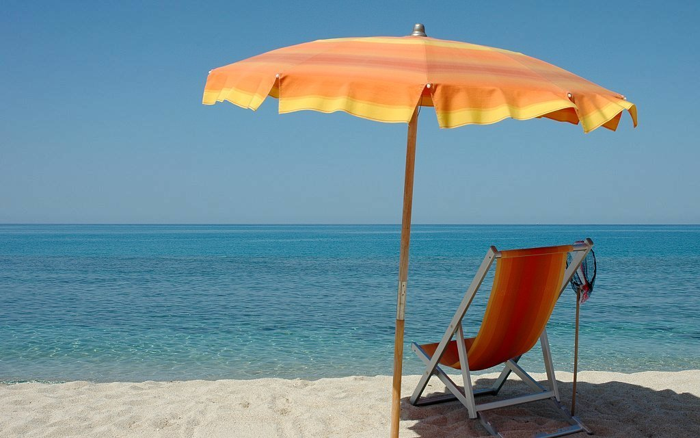
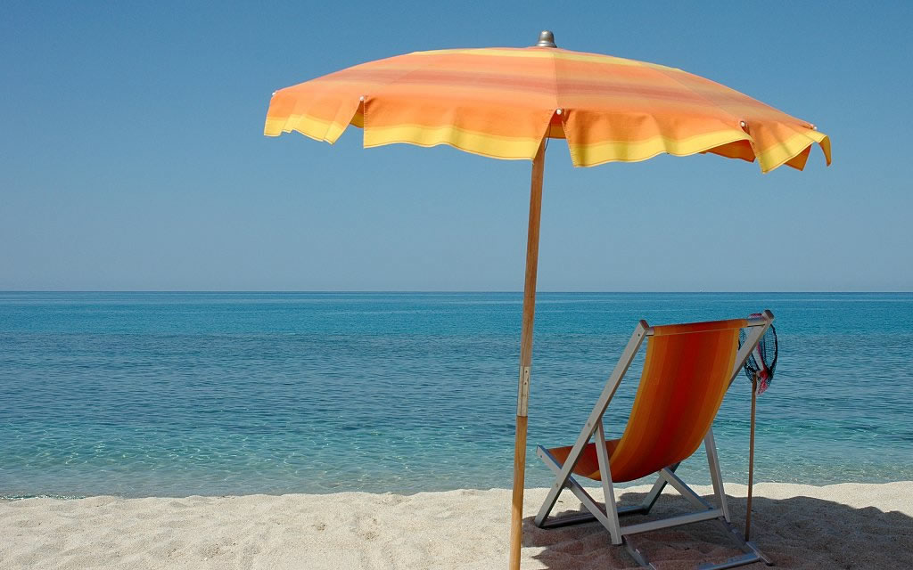

Adept - the adaptive JPG Compressor
====================

## Quick Start

soon

## Introduction

When compressing JPEG images, the same compression level is used on the entire image. However, most JPEG images contain homogeneous and heterogeneous areas, which are varyingly well-suited for compression. Compressing heterogeneous areas in JPEGs to reduce filesize causes [compression artefacts](https://en.wikipedia.org/wiki/Compression_artifact) due to the lossy nature of JPEG compression.

This script adaptively alters the compression level for areas within JPEGs to achieve optimal filesize while maintaining decent visual quality. Currently, this script achieves an average 3-5% of reduced filesize compared to standard CLI tools such as jpegoptim while still maintaining good visual quality. This is primarily interesting for the [#WebPerf](https://twitter.com/search?q=%23WebPerf&src=typd) community.

Note that adaptive JPEG compression is already implemented in tools such as Adobe Photoshop and Fireworks. This script brings adaptive JPEG compression to the shell using common console tools already installed on many machines dealing with automated image optimization. The script is save to use as ELA, the [Error Level Analysis Algorithm](http://fotoforensics.com/tutorial-ela.php), does [not flag the images as tainted](http://fotoforensics.com/analysis.php?id=9955933a9ea6774a0e58303db1ac104af8dafd41.107232).

## Image Demos

** GIMP, Save For Web Plugin, Quality 85 - 112,7 kB**

** JPEGOptim --max=85 -t -v --strip-all + lossless JPEGRescan - 110,4 kB**

** Adept - 107,2 kB**

** Adobe Fireworks + @pornelski's ImageOptim - 106,9 kB**

** JPEGMini - 98,4 kB**

## Known Issues

## Contributors

## Licence